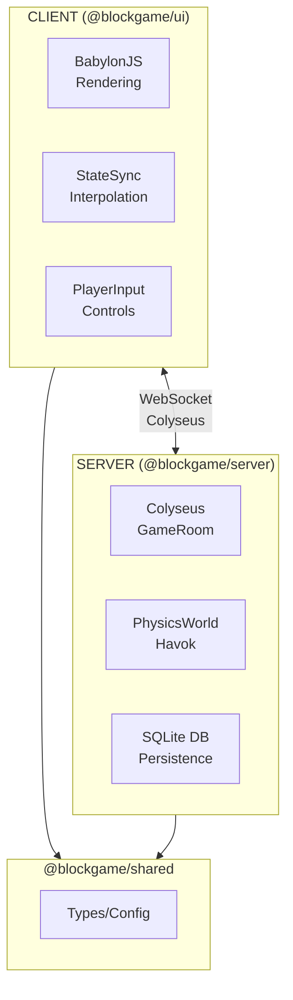
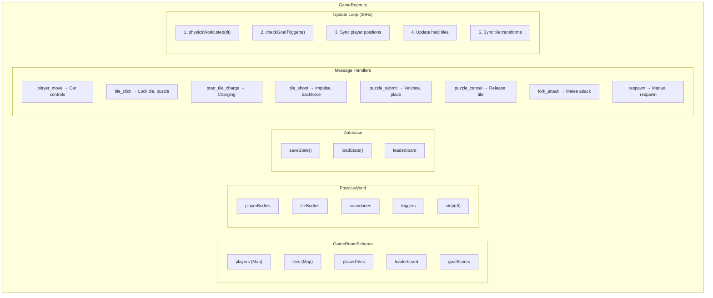
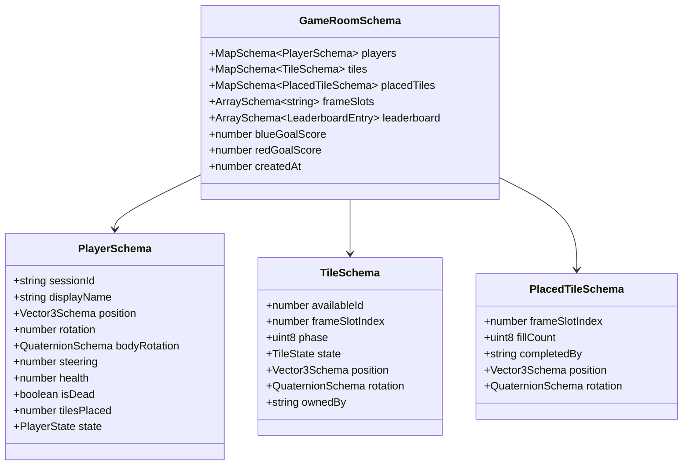
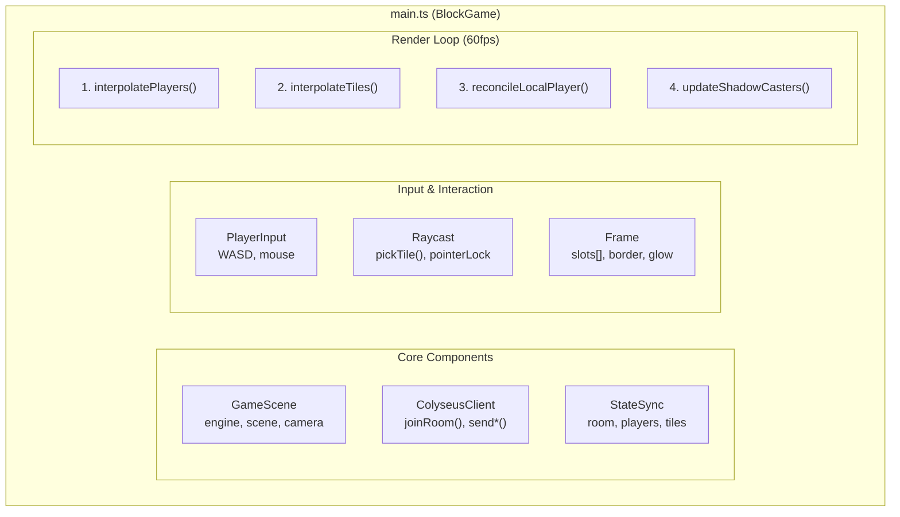
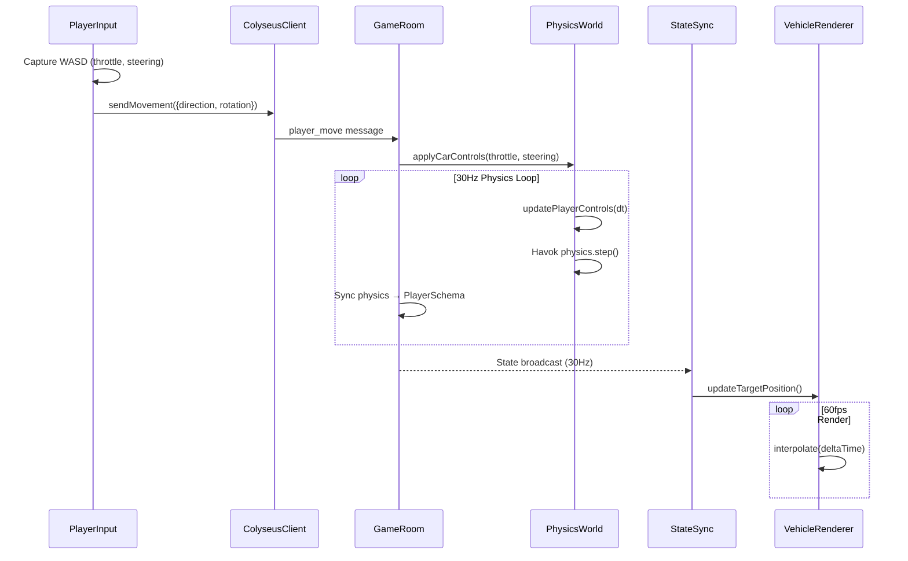
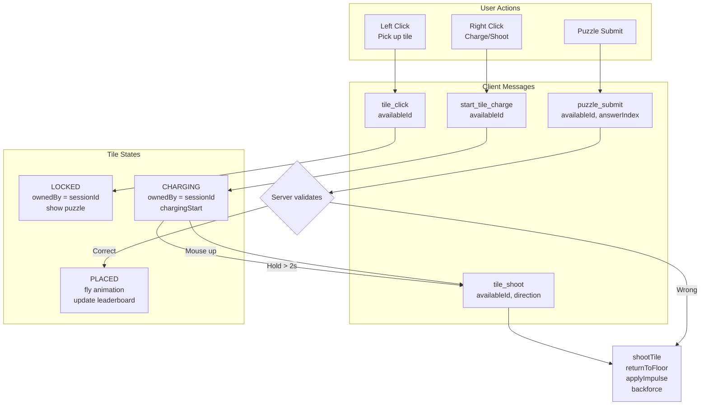
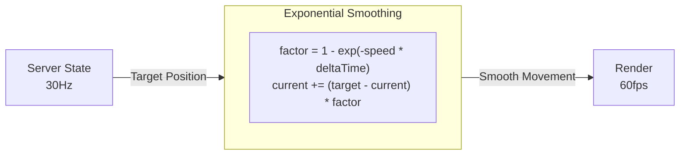
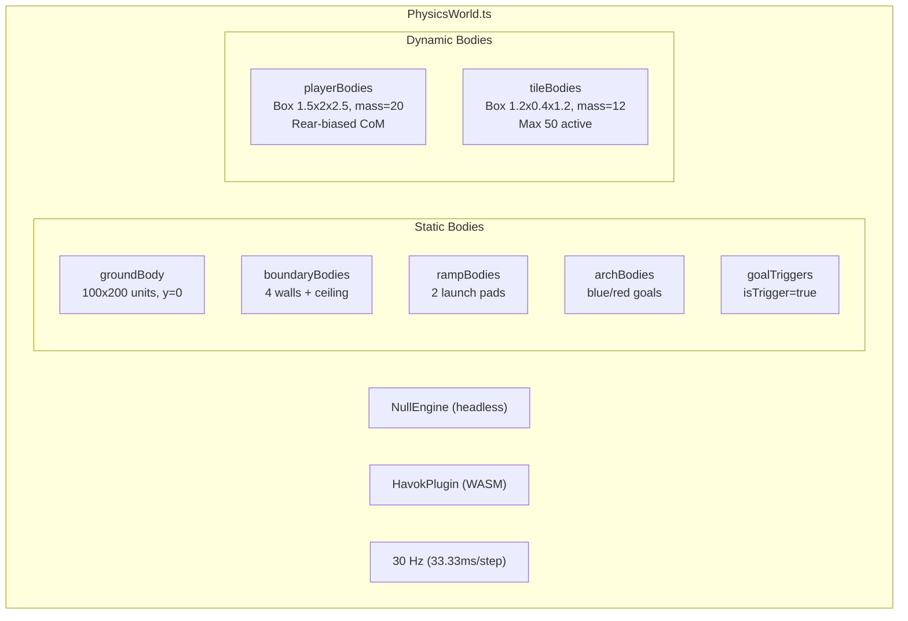

# BlockGame Architecture Overview

## Table of Contents

1. [High-Level Architecture](#high-level-architecture)
2. [Server Architecture](#server-architecture)
3. [Client Architecture](#client-architecture)
4. [Data Flow](#data-flow)
5. [State Synchronization](#state-synchronization)
6. [Physics Architecture](#physics-architecture)

---

## High-Level Architecture



### Key Principles

| Principle | Description |
|-----------|-------------|
| **Server Authoritative** | Server owns ALL game state. Client renders server state. |
| **Single Source of Truth** | No client-side prediction for tiles. Server validates everything. |
| **Two-Spawn System** | 800 available tiles (0-799), each fills half of 400 frame slots. |
| **30Hz Physics** | Server runs Havok at 30Hz, syncs at 30Hz (patch rate). |

---

## Server Architecture

### Package Structure

```
packages/server/
├── src/
│   ├── index.ts                    # Entry point, Colyseus server setup
│   ├── config/
│   │   └── encoder.ts              # Encoder buffer configuration
│   ├── database/
│   │   ├── init.ts                 # SQLite initialization
│   │   ├── leaderboard.ts          # Leaderboard queries
│   │   └── roomState.ts            # Room state persistence
│   ├── monitoring/
│   │   ├── MetricsCollector.ts     # PM2 metrics aggregation
│   │   └── PM2Metrics.ts           # PM2 integration
│   ├── physics/
│   │   ├── PhysicsConstants.ts     # Physics tuning values
│   │   └── PhysicsWorld.ts         # Havok physics simulation
│   ├── rooms/
│   │   └── GameRoom.ts             # Main game room logic
│   ├── schema/
│   │   ├── GameRoomSchema.ts       # Root state schema
│   │   ├── PlayerSchema.ts         # Player state
│   │   ├── TileSchema.ts           # Available tile state
│   │   ├── PlacedTileSchema.ts     # Placed tile in frame
│   │   ├── LeaderboardSchema.ts    # Leaderboard entries
│   │   ├── Vector3Schema.ts        # 3D vector
│   │   ├── QuaternionSchema.ts     # Rotation quaternion
│   │   └── PuzzleConfigSchema.ts   # Puzzle configuration
│   └── utils/
│       └── PuzzleGenerator.ts      # Puzzle generation
```

### GameRoom Component Diagram



### State Schema Hierarchy



---

## Client Architecture

### Package Structure

```
packages/ui/
├── src/
│   ├── main.ts                     # Entry point, BlockGame class
│   ├── game/
│   │   ├── Scene.ts                # BabylonJS scene setup
│   │   ├── Camera.ts               # Third-person ArcRotate camera
│   │   ├── Floor.ts                # Ground rendering
│   │   ├── Frame.ts                # Picture frame rendering
│   │   ├── Physics.ts              # Client-side prediction physics
│   │   ├── Vehicle.ts              # Vehicle renderer (monster truck)
│   │   ├── Tile.ts                 # Tile mesh with texture
│   │   ├── TilePool.ts             # Object pooling for tiles
│   │   ├── Raycast.ts              # Click detection
│   │   ├── PlayerInput.ts          # WASD/mouse controls
│   │   ├── Sound.ts                # Sound effects
│   │   ├── Scoreboard.ts           # Goal score display
│   │   └── LeaderboardWall.ts      # 3D leaderboard in world
│   ├── gui/
│   │   ├── NameInputGUI.ts         # Login screen
│   │   ├── LeaderboardGUI.ts       # 2D leaderboard overlay
│   │   ├── GameCompleteGUI.ts      # Victory screen
│   │   ├── CompassGUI.ts           # Direction compass
│   │   ├── HelpGUI.ts              # Controls help
│   │   ├── EscMenuGUI.ts           # Escape menu
│   │   ├── DisconnectGUI.ts        # Disconnect overlay
│   │   └── DeathCountdownGUI.ts    # Respawn countdown
│   ├── network/
│   │   ├── ColyseusClient.ts       # WebSocket connection
│   │   └── StateSync.ts            # State → Rendering sync
│   └── puzzles/
│       ├── MultipleChoiceGUI.ts    # Quiz puzzle UI
│       └── MemoryCardsGUI.ts       # Memory game UI
```

### Client Component Diagram



---

## Data Flow

### Player Movement Flow



### Tile Interaction Flow



---

## State Synchronization

### Colyseus Patch Rate

| Setting | Value | Description |
|---------|-------|-------------|
| Server Physics | **30 Hz** | `setSimulationInterval(cb, 33.33ms)` |
| Patch Rate | **30 Hz** | `setPatchRate(33.33ms)` |
| Client Interpolation | Per frame | `scene.onBeforeRenderObservable` |

### State Change Listeners (Client)

```typescript
// Colyseus v0.16+ API (REQUIRED - old API doesn't work)
const $ = getStateCallbacks(room);

// Players
$(room.state.players).onAdd((player, sessionId) => {
  $(player).position.onChange(() => updateTargetPosition());
  $(player).bodyRotation.onChange(() => updateTargetRotation());
  $(player).listen('steering', (value) => updateTargetSteering());
  $(player).listen('health', (value) => updateHealth());
});

// Available Tiles
$(room.state.tiles).onAdd((tile, availableId) => {
  $(tile).position.onChange(() => updateTilePosition());
  $(tile).rotation.onChange(() => updateTileRotation());
  $(tile).listen('state', (state) => updateTileState());
});

// Placed Tiles
$(room.state.placedTiles).onAdd((placedTile, frameSlotIndex) => {
  $(placedTile).listen('fillCount', (count) => updateFillState());
});
```

### Interpolation Strategy



| Entity | Smoothing Speed | Feel |
|--------|-----------------|------|
| Local player position | 18/sec | Very responsive |
| Remote player position | 12/sec | Smooth |
| Rotation (all) | 15/sec | Medium |
| Steering (wheels) | 20/sec | Responsive |
| Tiles | 15/sec | Medium |

---

## Physics Architecture

### Server Physics (Authoritative)



### Physics Constants

```typescript
// Server tick rates
PHYSICS_SIMULATION_RATE: 30    // Hz
STATE_PATCH_RATE: 30           // Hz

// Player vehicle physics
PLAYER_MASS: 20.0
PLAYER_MOVEMENT_FORCE: 1000.0
PLAYER_MAX_SPEED: 25.0
PLAYER_LINEAR_DAMPING: 0.5
PLAYER_ANGULAR_DAMPING: 2.0
PLAYER_STEERING_SPEED: 2.0      // Radians/sec
PLAYER_MAX_STEERING_ANGLE: 1.5  // Max turn rate

// Tile physics
TILE_MASS: 12.0
TILE_FRICTION: 0.3
TILE_RESTITUTION: 0.15

// Shooting mechanics
IMPULSE_BASE: 10                // Min impulse (strength=1)
IMPULSE_MAX: 3000               // Max impulse (strength=100)
BACKFORCE_BASE: 9               // Min recoil
BACKFORCE_MAX: 1000             // Max recoil

// Combat
MIN_SHOT_VELOCITY_FOR_DAMAGE: 20.0  // units/s threshold
```

---

## Key File Locations

| Component | File |
|-----------|------|
| Game room logic | `packages/server/src/rooms/GameRoom.ts` |
| Physics simulation | `packages/server/src/physics/PhysicsWorld.ts` |
| State schema | `packages/server/src/schema/GameRoomSchema.ts` |
| Client scene | `packages/ui/src/game/Scene.ts` |
| State sync | `packages/ui/src/network/StateSync.ts` |
| World config | `packages/shared/src/config/world.ts` |
| Physics constants | `packages/server/src/physics/PhysicsConstants.ts` |
