# BlockGame - Complete Game Logic Documentation

## Table of Contents
1. [Architecture Overview](#architecture-overview)
2. [Server Game Room Logic](#server-game-room-logic)
3. [Physics System](#physics-system)
4. [Client Game Entities](#client-game-entities)
5. [Network & State Synchronization](#network--state-synchronization)
6. [Shared Types & Configuration](#shared-types--configuration)
7. [Puzzles System](#puzzles-system)
8. [GUI Components](#gui-components)
9. [Data Flow & Communication Patterns](#data-flow--communication-patterns)

---

## Architecture Overview

### Server-Authoritative Design

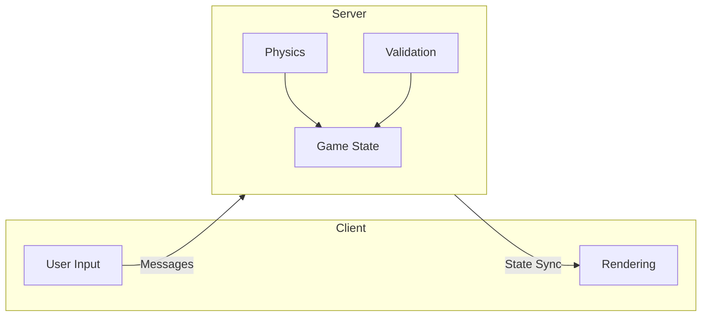

**Server Responsibilities:**
- Owns and controls ALL game state (players, tiles, frame, leaderboard)
- Validates ALL client actions (tile clicks, puzzle results, frame placement)
- Runs physics simulation at 30Hz using BabylonJS Havok on NullEngine
- Broadcasts state changes to all clients via Colyseus (30Hz patch rate)
- Prevents cheating by validating all inputs

**Client Responsibilities:**
- Renders game state received from server
- Captures user input (WASD movement, mouse clicks, puzzle interactions)
- Sends input to server as messages
- Interpolates positions for smooth visuals at 60fps
- Runs fly animations locally (client-side)

---

## Server Game Room Logic

### GameRoom Class (`packages/server/src/rooms/GameRoom.ts`)

The GameRoom is the heart of the multiplayer game, managing all game state and physics.

#### Configuration
- `maxClients = 300` - supports up to 300 concurrent players
- `autoDispose = false` - room stays alive when empty for state persistence

#### Two-Spawn Tile System

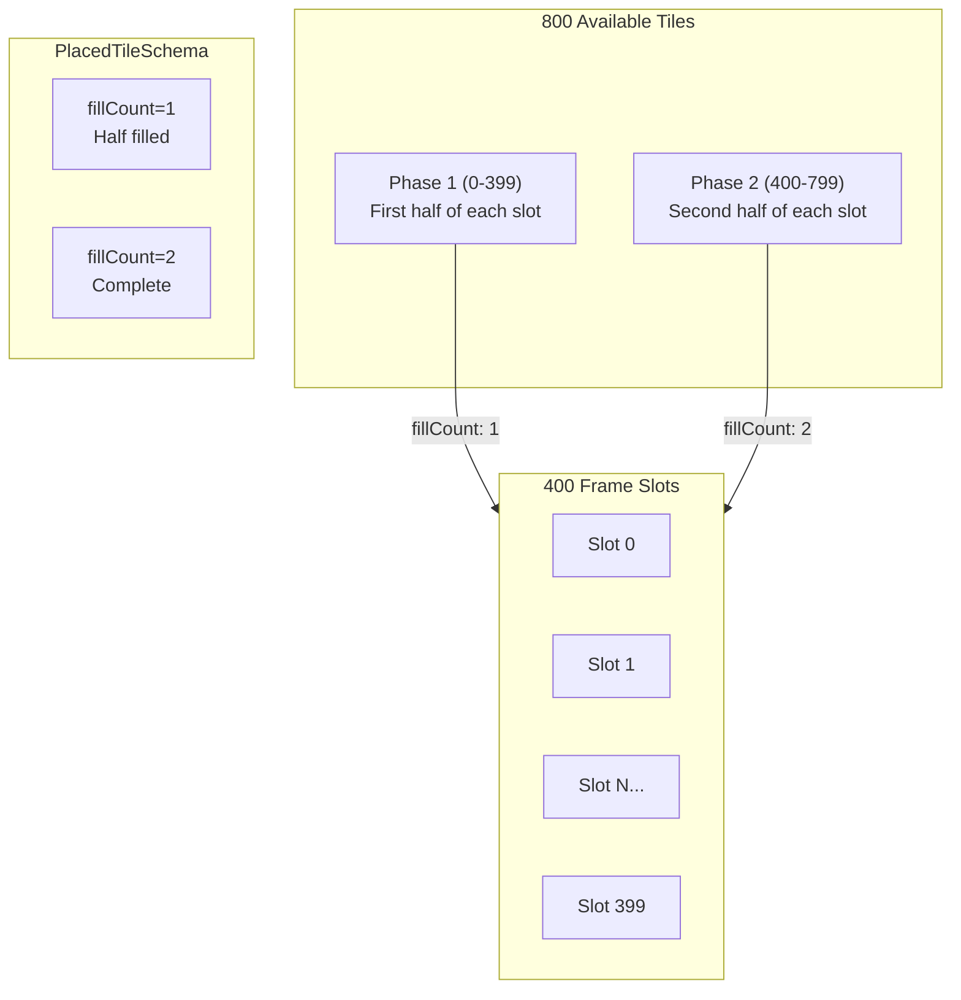

#### Message Handlers

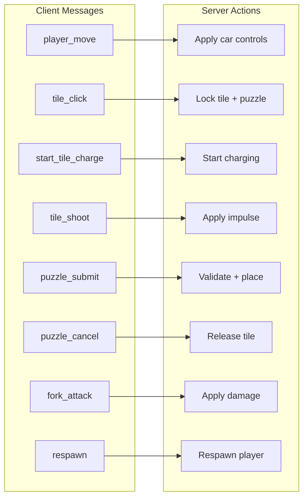

#### Physics Update Loop (30Hz)

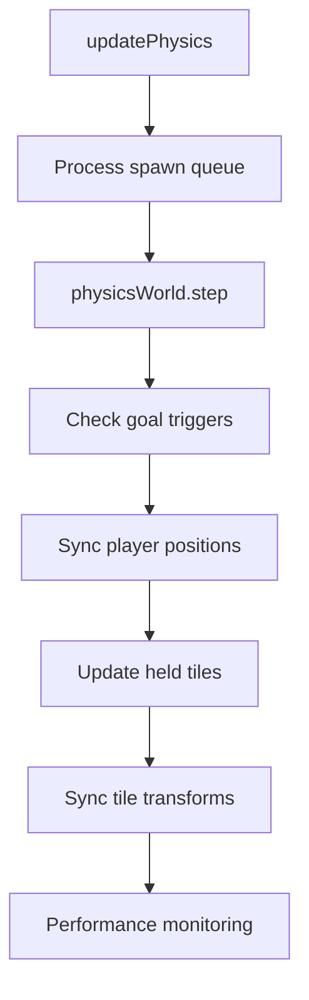

---

## Physics System

### PhysicsWorld Class (`packages/server/src/physics/PhysicsWorld.ts`)

Server-side physics using BabylonJS NullEngine + Havok WASM.

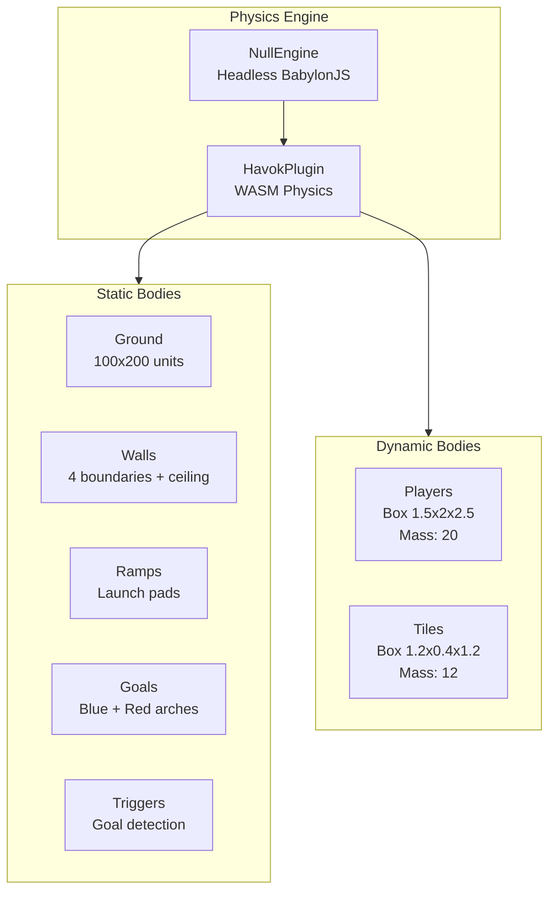

### Physics Constants

| Category | Constant | Value |
|----------|----------|-------|
| **Tick Rate** | PHYSICS_SIMULATION_RATE | 30 Hz |
| **Tick Rate** | STATE_PATCH_RATE | 30 Hz |
| **Player** | PLAYER_MASS | 20.0 |
| **Player** | PLAYER_MOVEMENT_FORCE | 1000.0 |
| **Player** | PLAYER_MAX_SPEED | 25.0 units/s |
| **Player** | PLAYER_ANGULAR_DAMPING | 2.0 |
| **Tile** | TILE_MASS | 12.0 |
| **Tile** | TILE_FRICTION | 0.3 |
| **Shooting** | IMPULSE_MAX | 3000 |
| **Combat** | MIN_SHOT_VELOCITY_FOR_DAMAGE | 20.0 units/s |

---

## Client Game Entities

### VehicleRenderer Class

```mermaid
graph TB
    subgraph Vehicle["Monster Truck"]
        Chassis[Chassis<br/>1.5x2x2.5]
        Body[Car Body<br/>Cabin, hood, fenders]
        Wheels[4 Wheels<br/>Animated steering]
        Forks[Fork Prongs<br/>Tile holder]
        HealthBar[Health Bar<br/>Billboard]
        NameLabel[Name Label<br/>Billboard]
    end

    subgraph Methods["Key Methods"]
        updateTarget[updateTargetPosition/Rotation]
        interpolate[interpolate deltaTime]
        updateHealth[updateHealth current, max]
        getAttach[getTileAttachmentPosition]
    end
```

### TileRenderer States

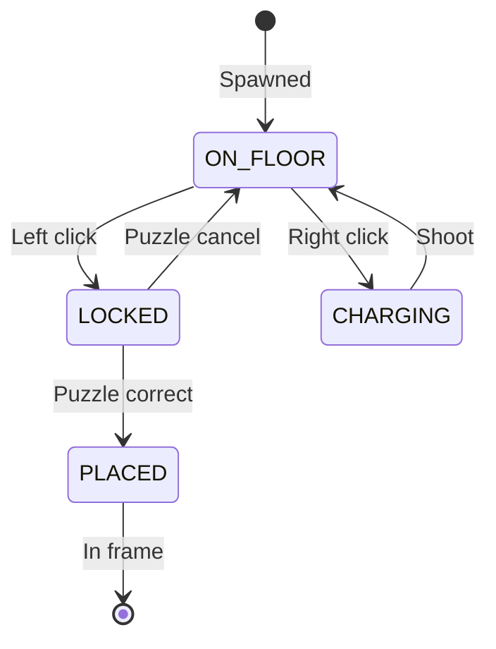

### PlayerInput Controls

| Input | Action |
|-------|--------|
| W/S | Throttle (forward/back) |
| A/D | Steering (left/right) |
| Left Click | Pick up tile |
| Right Click Hold | Charge tile |
| Right Click Release | Shoot tile |
| E Key | Fork attack (melee) |
| Mouse | Camera rotation |

---

## Network & State Synchronization

### ColyseusClient Methods

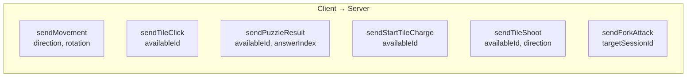

### StateSync Callbacks (Colyseus v0.16+)

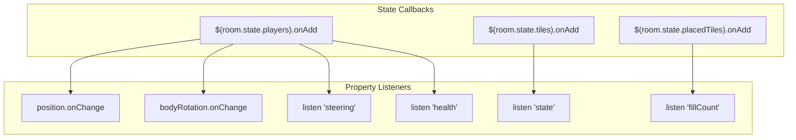

---

## Shared Types & Configuration

### Tile States

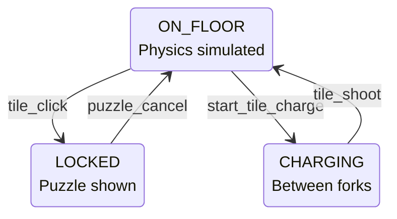

### Player States

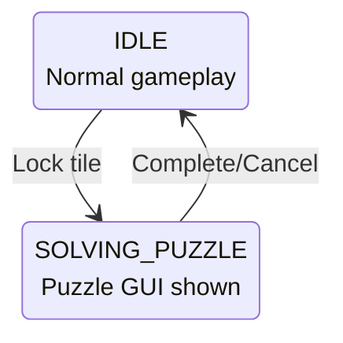

### World Configuration

| Config | Value |
|--------|-------|
| Floor Size | 100 x 200 units |
| Frame Slots | 400 |
| Available Tiles | 800 (2 per slot) |
| Max Active Tiles | 50 on floor |
| Player Max Health | 100 |
| Tile Damage | 20 |
| Fork Damage | 5 |

---

## Puzzles System

### Multiple Choice Flow

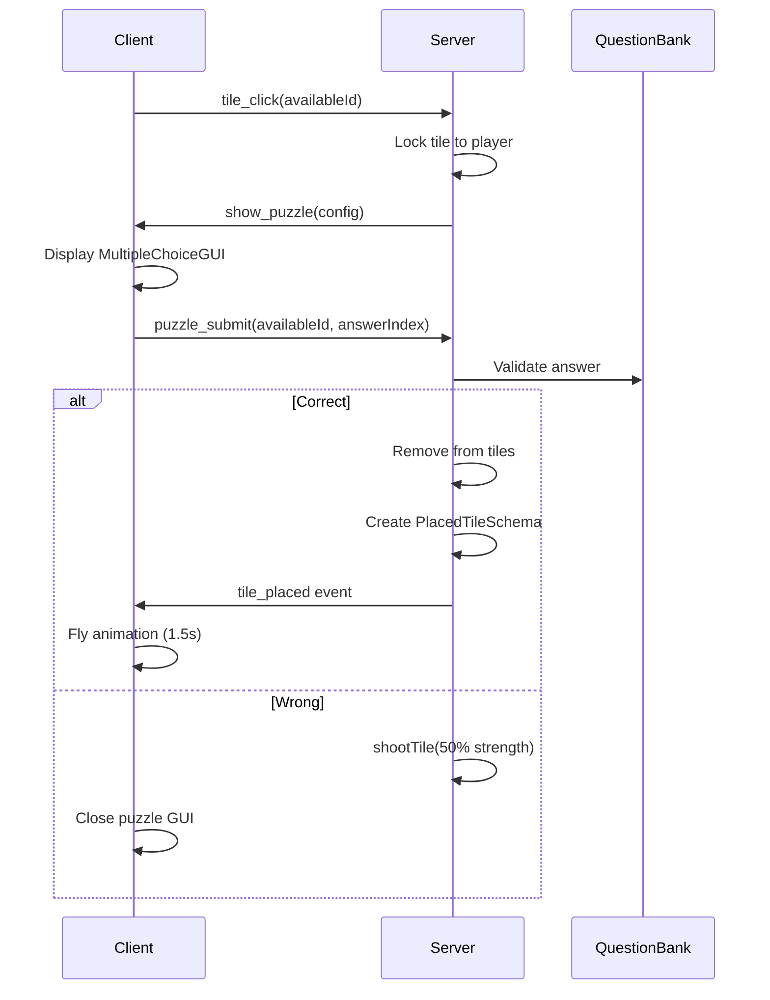

---

## GUI Components

| Component | Purpose |
|-----------|---------|
| NameInputGUI | Login screen |
| LeaderboardGUI | Top players overlay |
| GameCompleteGUI | Victory screen |
| CompassGUI | Direction display |
| HelpGUI | Controls help |
| EscMenuGUI | Escape menu |
| DisconnectGUI | Disconnect overlay |
| DeathCountdownGUI | Respawn countdown |
| MultipleChoiceGUI | Quiz puzzle |
| MemoryCardsGUI | Memory game |

---

## Data Flow & Communication Patterns

### Player Movement Flow

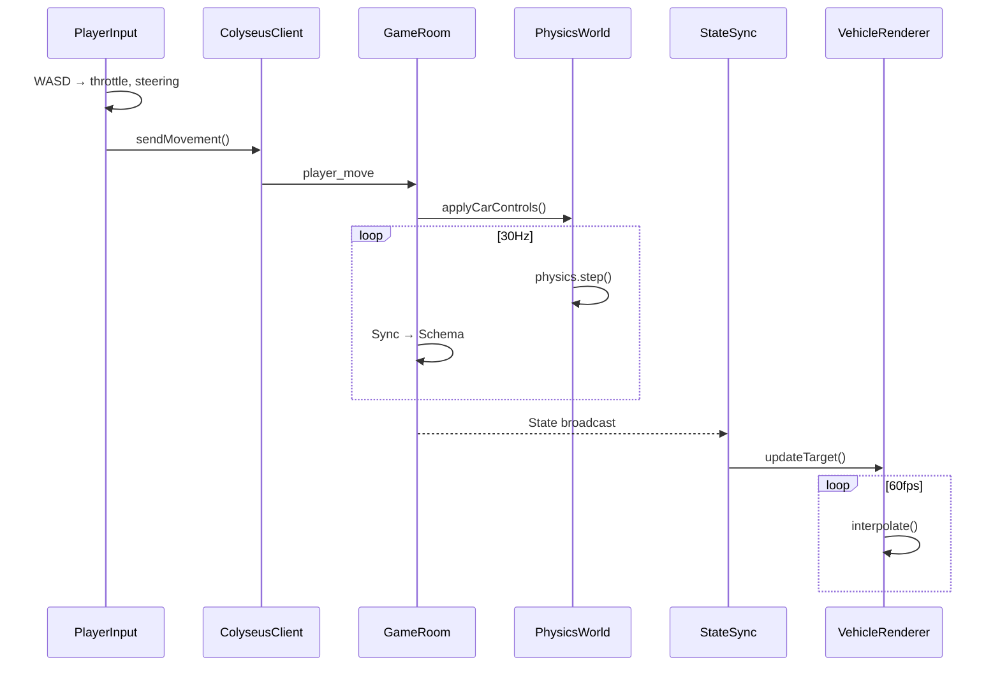

### Tile Shooting Flow

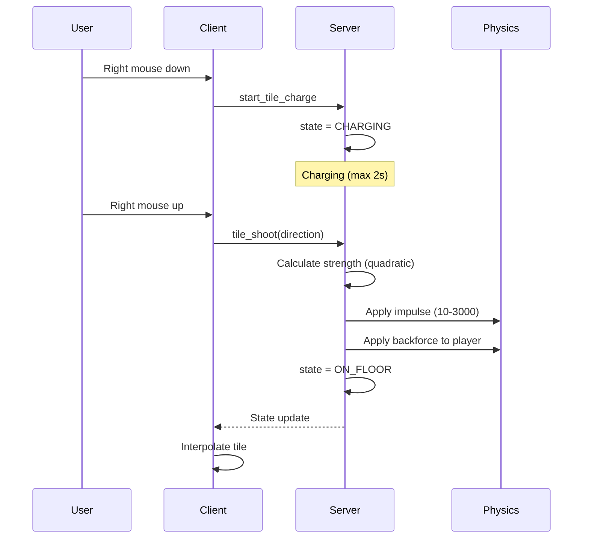

### Goal Scoring Flow

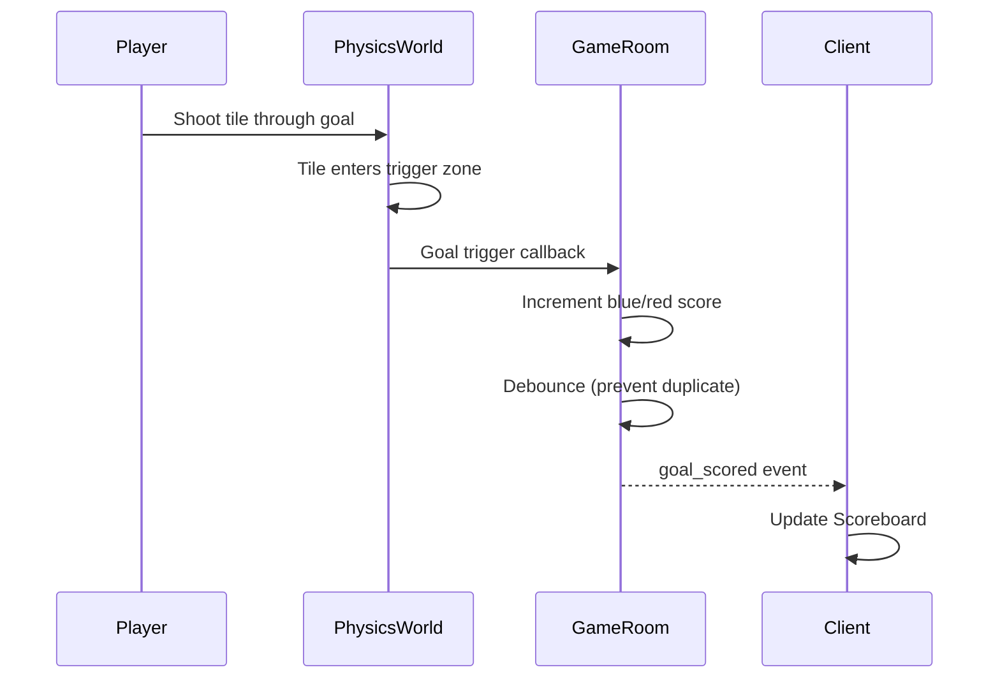

### Combat Flow

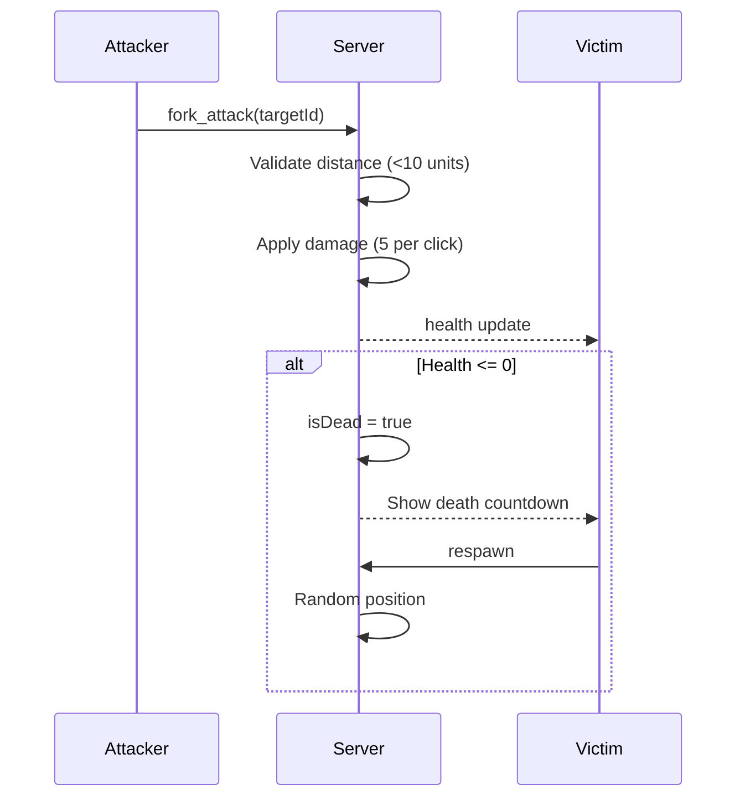

---

## Key File Locations

| Component | Path |
|-----------|------|
| Server GameRoom | `packages/server/src/rooms/GameRoom.ts` |
| Physics World | `packages/server/src/physics/PhysicsWorld.ts` |
| Physics Constants | `packages/server/src/physics/PhysicsConstants.ts` |
| Game Room Schema | `packages/server/src/schema/GameRoomSchema.ts` |
| Tile Schema | `packages/server/src/schema/TileSchema.ts` |
| Placed Tile Schema | `packages/server/src/schema/PlacedTileSchema.ts` |
| Player Schema | `packages/server/src/schema/PlayerSchema.ts` |
| Client Scene | `packages/ui/src/game/Scene.ts` |
| Vehicle Renderer | `packages/ui/src/game/Vehicle.ts` |
| Tile Renderer | `packages/ui/src/game/Tile.ts` |
| Player Input | `packages/ui/src/game/PlayerInput.ts` |
| Raycast | `packages/ui/src/game/Raycast.ts` |
| Colyseus Client | `packages/ui/src/network/ColyseusClient.ts` |
| State Sync | `packages/ui/src/network/StateSync.ts` |
| World Config | `packages/shared/src/config/world.ts` |
