# BlockGame - Game Logic

## Table of Contents
1. [Architecture Overview](#architecture-overview)
2. [Server Game Room Logic](#server-game-room-logic)
3. [Physics System](#physics-system)
4. [Client Game Entities](#client-game-entities)
5. [Network & State Synchronization](#network--state-synchronization)
6. [Shared Types & Configuration](#shared-types--configuration)
7. [Puzzles System](#puzzles-system)
8. [GUI Components](#gui-components)
9. [Data Flow & Communication Patterns](#data-flow--communication-patterns)
10. [Join & Persistence](#join--persistence)

---

## Architecture Overview

### Server-Authoritative Design

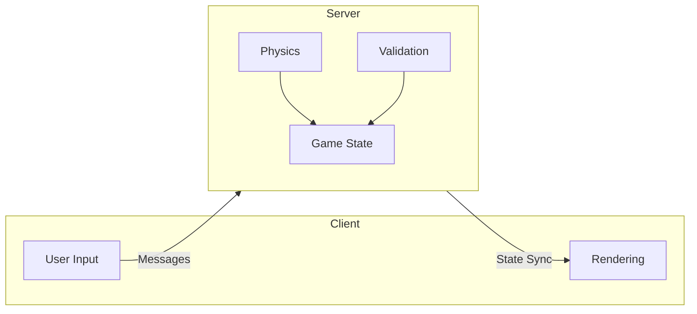
```mermaid
graph LR
    subgraph Client
        Input[User Input]
        Render[Rendering]
    end

    subgraph Server
        State[Game State]
        Physics[Physics]
        Validation[Validation]
    end

    Input -->|Messages| Server
    Server -->|State Sync| Render
    Physics --> State
    Validation --> State
```

**Server Responsibilities:**
- Owns and controls ALL game state (players, tiles, frame, leaderboard)
- Validates tile clicks, charge/shoot requests, puzzle answers (via QuestionBank) and fork attack range
- Runs physics simulation at 30Hz using BabylonJS Havok on NullEngine
- Broadcasts state changes to all clients via Colyseus (30Hz patch rate)

**Client Responsibilities:**
- Renders game state received from server
- Captures user input (arrow-key driving, mouse clicks, puzzle interactions)
- Sends input to server as messages
- Interpolates positions for smooth visuals at 60fps
- Runs fly animations locally (client-side)

---

## Server Game Room Logic

### GameRoom Class (`packages/server/src/rooms/GameRoom.ts`)

GameRoom owns all game state, handles client messages and runs the physics loop.

#### Configuration
- `maxClients = 300` - supports up to 300 concurrent players
- `autoDispose = false` - room stays alive when empty for state persistence

#### Two-Spawn Tile System

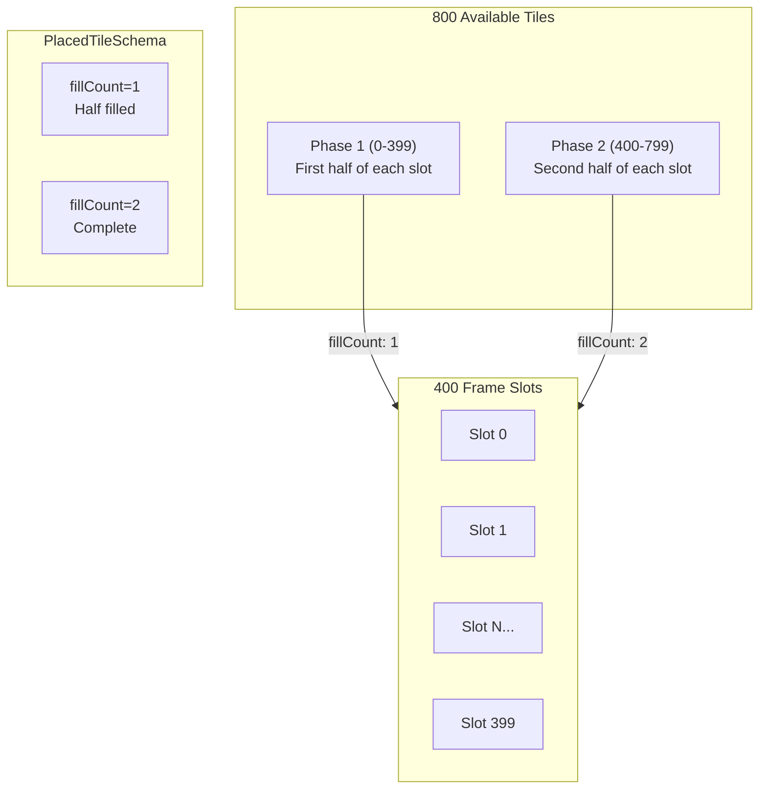
```mermaid
graph TB
    subgraph AvailableTiles["800 Available Tiles"]
        Phase1["Phase 1 (0-399)<br/>First half of each slot"]
        Phase2["Phase 2 (400-799)<br/>Second half of each slot"]
    end

    subgraph FrameSlots["400 Frame Slots"]
        Slot0["Slot 0"]
        Slot1["Slot 1"]
        SlotN["Slot N..."]
        Slot399["Slot 399"]
    end

    Phase1 -->|fillCount: 1| FrameSlots
    Phase2 -->|fillCount: 2| FrameSlots

    subgraph PlacedTile["PlacedTileSchema"]
        half["fillCount=1<br/>Half filled"]
        complete["fillCount=2<br/>Complete"]
    end
```

- At most 50 tiles are on the floor at once (`MAX_ACTIVE_TILES`). The rest wait server-side as `NOT_SPAWNED` and are not synced to clients.
- Solving a phase 1 tile half-fills its slot and queues the phase 2 tile for the same slot. Solving the phase 2 tile completes the slot and queues the next tile from the pool. The spawn queue creates at most 2 tiles per physics frame.
- The puzzle is generated when a player picks the tile up. Question id = `frameSlotIndex + (phase - 1) * 400`, so phase 1 uses questions 0-399 and phase 2 uses 400-799.

#### Message Handlers

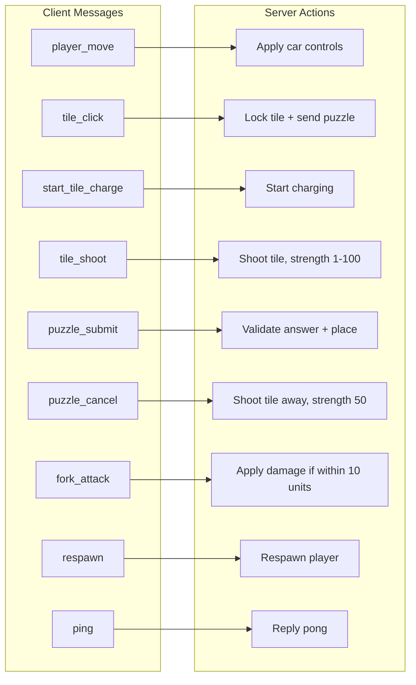
```mermaid
graph LR
    subgraph Messages["Client Messages"]
        pm[player_move]
        tc[tile_click]
        stc[start_tile_charge]
        ts[tile_shoot]
        ps[puzzle_submit]
        pc[puzzle_cancel]
        fa[fork_attack]
        rs[respawn]
        pg[ping]
    end

    subgraph Actions["Server Actions"]
        car[Apply car controls]
        lock[Lock tile + send puzzle]
        charge[Start charging]
        impulse[Shoot tile, strength 1-100]
        validate[Validate answer + place]
        release[Shoot tile away, strength 50]
        damage[Apply damage if within 10 units]
        spawn[Respawn player]
        pong[Reply pong]
    end

    pm --> car
    tc --> lock
    stc --> charge
    ts --> impulse
    ps --> validate
    pc --> release
    fa --> damage
    rs --> spawn
    pg --> pong
```

#### Physics Update Loop (30Hz)

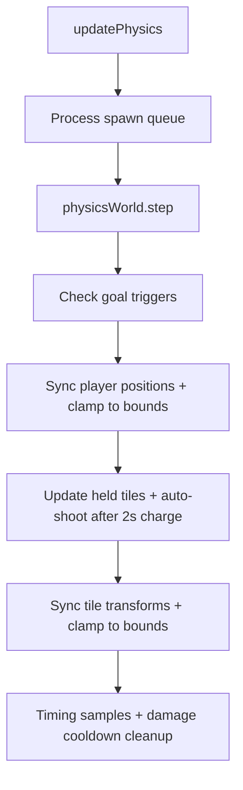
```mermaid
flowchart TD
    A[updatePhysics] --> B[Process spawn queue]
    B --> C[physicsWorld.step]
    C --> D[Check goal triggers]
    D --> E[Sync player positions + clamp to bounds]
    E --> F[Update held tiles + auto-shoot after 2s charge]
    F --> G[Sync tile transforms + clamp to bounds]
    G --> H[Timing samples + damage cooldown cleanup]
```

---

## Physics System

### PhysicsWorld Class (`packages/server/src/physics/PhysicsWorld.ts`)

Server-side physics using BabylonJS NullEngine + Havok WASM.

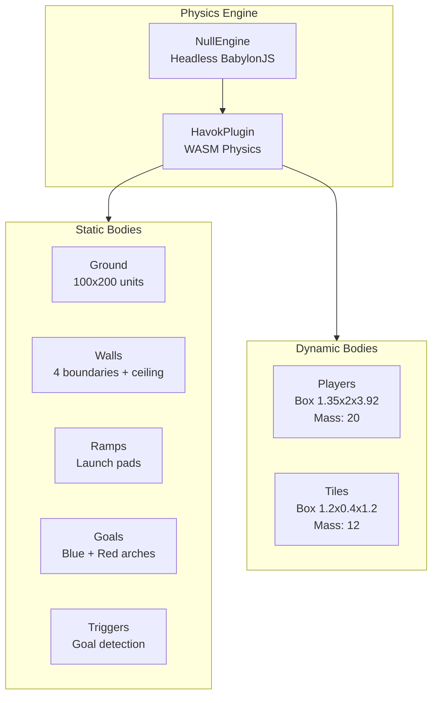
```mermaid
graph TB
    subgraph Engine["Physics Engine"]
        NE[NullEngine<br/>Headless BabylonJS]
        HP[HavokPlugin<br/>WASM Physics]
    end

    subgraph Static["Static Bodies"]
        ground[Ground<br/>100x200 units]
        walls[Walls<br/>4 boundaries + ceiling]
        ramps[Ramps<br/>Launch pads]
        goals[Goals<br/>Blue + Red arches]
        triggers[Triggers<br/>Goal detection]
    end

    subgraph Dynamic["Dynamic Bodies"]
        players[Players<br/>Box 1.35x2x3.92<br/>Mass: 20]
        tiles[Tiles<br/>Box 1.2x0.4x1.2<br/>Mass: 12]
    end

    NE --> HP
    HP --> Static
    HP --> Dynamic
```

### Physics Constants

| Category | Constant | Value |
|----------|----------|-------|
| **Tick Rate** | PHYSICS_SIMULATION_RATE | 30 Hz |
| **Tick Rate** | STATE_PATCH_RATE | 30 Hz |
| **Player** | PLAYER_MASS | 20.0 |
| **Player** | PLAYER_MOVEMENT_FORCE | 1000.0 |
| **Player** | PLAYER_MAX_SPEED | 25.0 units/s |
| **Player** | PLAYER_ANGULAR_DAMPING | 2.0 |
| **Tile** | TILE_MASS | 12.0 |
| **Tile** | TILE_FRICTION | 0.3 |
| **Shooting** | IMPULSE_MAX | 3000 |
| **Combat** | MIN_SHOT_VELOCITY_FOR_DAMAGE | 20.0 units/s |

---

## Client Game Entities

### VehicleRenderer Class

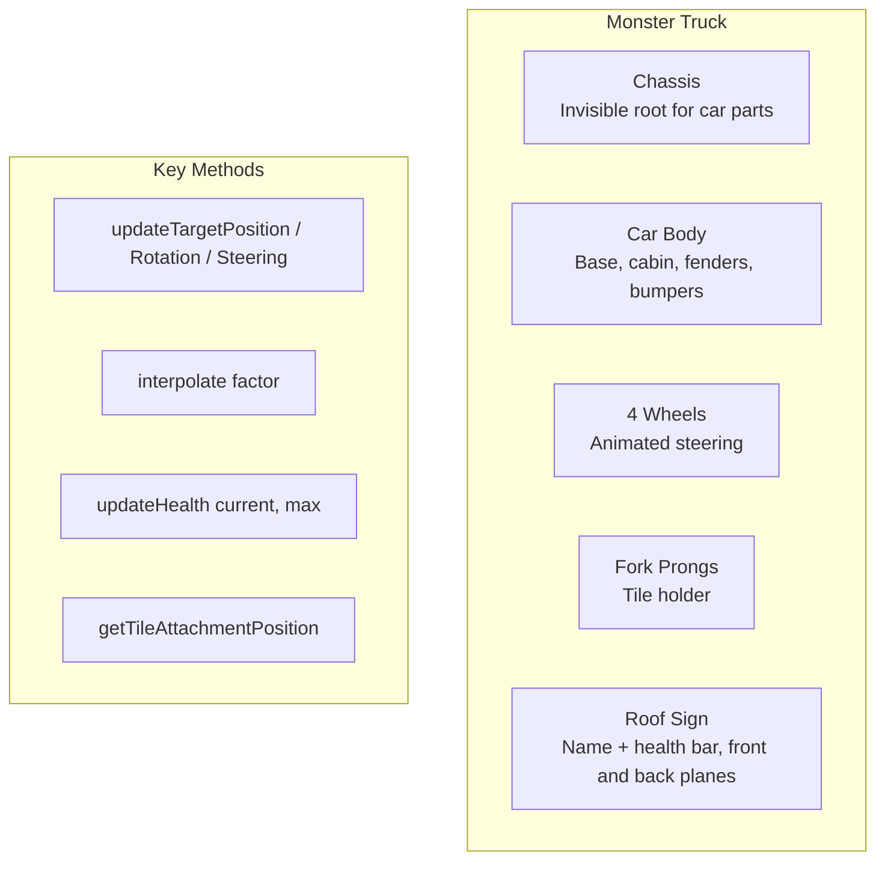
```mermaid
graph TB
    subgraph Vehicle["Monster Truck"]
        Chassis[Chassis<br/>Invisible root for car parts]
        Body[Car Body<br/>Base, cabin, fenders, bumpers]
        Wheels[4 Wheels<br/>Animated steering]
        Forks[Fork Prongs<br/>Tile holder]
        RoofSign[Roof Sign<br/>Name + health bar, front and back planes]
    end

    subgraph Methods["Key Methods"]
        updateTarget["updateTargetPosition / Rotation / Steering"]
        interp[interpolate factor]
        updateHealth[updateHealth current, max]
        getAttach[getTileAttachmentPosition]
    end
```

### TileRenderer States

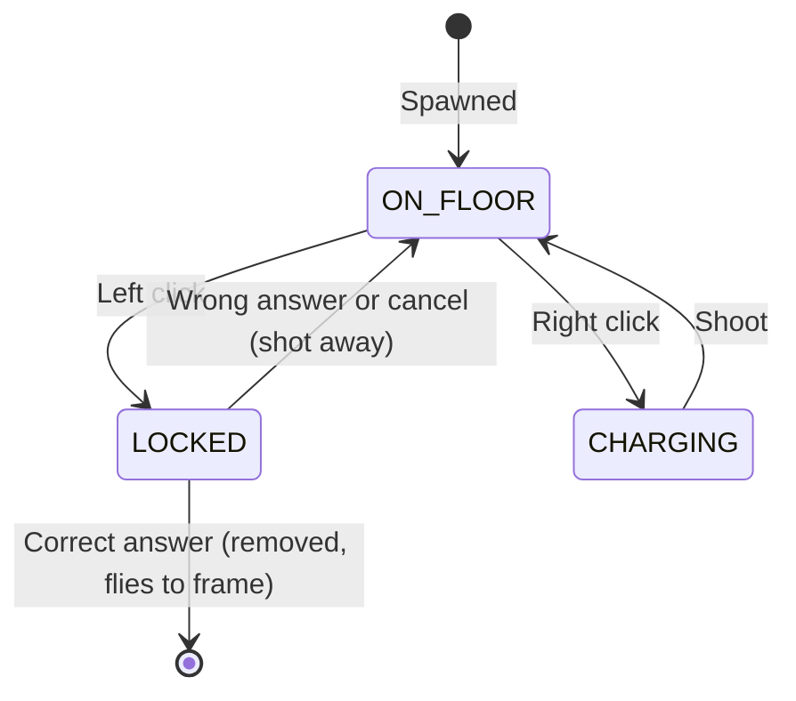
```mermaid
stateDiagram-v2
    [*] --> ON_FLOOR: Spawned
    ON_FLOOR --> LOCKED: Left click
    ON_FLOOR --> CHARGING: Right click
    LOCKED --> ON_FLOOR: Wrong answer or cancel (shot away)
    LOCKED --> [*]: Correct answer (removed, flies to frame)
    CHARGING --> ON_FLOOR: Shoot
```

### Controls

Driving is handled by `PlayerInput`, mouse actions by `Raycast`.

| Input | Action |
|-------|--------|
| Arrow Up/Down | Throttle (forward/back) |
| Arrow Left/Right | Steering (left/right) |
| Left Click | Pick up tile in the pickup zone |
| Left Click (fork tip touching another player) | Fork attack (melee) |
| Right Click Hold | Charge tile |
| Right Click Release | Shoot tile (auto-shoots at full strength after 2s) |
| Mouse | Camera rotation |
| Esc | Menu (resume, respawn, help) |

---

## Network & State Synchronization

### ColyseusClient Methods

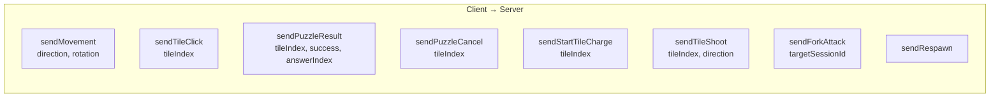
```mermaid
graph LR
    subgraph Send["Client → Server"]
        sendMovement[sendMovement<br/>direction, rotation]
        sendTileClick[sendTileClick<br/>tileIndex]
        sendPuzzle[sendPuzzleResult<br/>tileIndex, success, answerIndex]
        sendCancel[sendPuzzleCancel<br/>tileIndex]
        sendCharge[sendStartTileCharge<br/>tileIndex]
        sendShoot[sendTileShoot<br/>tileIndex, direction]
        sendFork[sendForkAttack<br/>targetSessionId]
        sendRespawn[sendRespawn]
    end
```

`tileIndex` in tile messages carries the tile's `availableId` (0-799).

### StateSync Callbacks (Colyseus v0.16+)

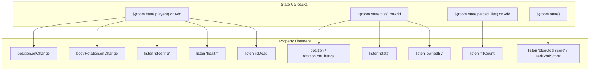
```mermaid
graph TB
    subgraph Callbacks["State Callbacks"]
        players["$(room.state.players).onAdd"]
        tiles["$(room.state.tiles).onAdd"]
        placed["$(room.state.placedTiles).onAdd"]
        root["$(room.state)"]
    end

    subgraph Listeners["Property Listeners"]
        pos["position.onChange"]
        rot["bodyRotation.onChange"]
        steer["listen 'steering'"]
        health["listen 'health'"]
        dead["listen 'isDead'"]
        tpos["position / rotation.onChange"]
        state["listen 'state'"]
        owner["listen 'ownedBy'"]
        fill["listen 'fillCount'"]
        goals["listen 'blueGoalScore' / 'redGoalScore'"]
    end

    players --> pos
    players --> rot
    players --> steer
    players --> health
    players --> dead
    tiles --> tpos
    tiles --> state
    tiles --> owner
    placed --> fill
    root --> goals
```

`players`, `tiles` and `placedTiles` also register `onRemove`. Initial slot fill state arrives in the `slot_states` message sent on join.

---

## Shared Types & Configuration

### Tile States

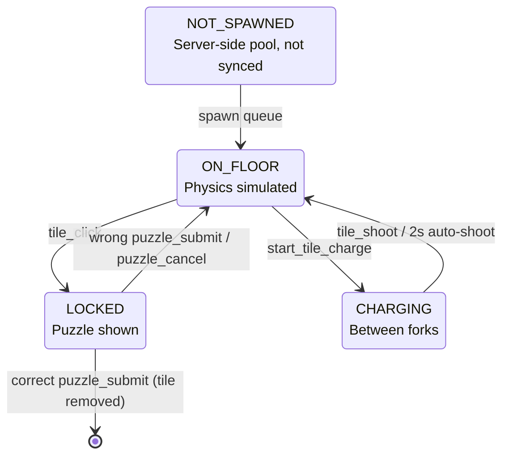
```mermaid
stateDiagram-v2
    NOT_SPAWNED: NOT_SPAWNED<br/>Server-side pool, not synced
    ON_FLOOR: ON_FLOOR<br/>Physics simulated
    LOCKED: LOCKED<br/>Puzzle shown
    CHARGING: CHARGING<br/>Between forks

    NOT_SPAWNED --> ON_FLOOR: spawn queue
    ON_FLOOR --> LOCKED: tile_click
    ON_FLOOR --> CHARGING: start_tile_charge
    LOCKED --> ON_FLOOR: wrong puzzle_submit / puzzle_cancel
    LOCKED --> [*]: correct puzzle_submit (tile removed)
    CHARGING --> ON_FLOOR: tile_shoot / 2s auto-shoot
```

LOCKED and CHARGING tiles follow the player's fork attach point every physics tick. The `TileState` enum also defines `FLYING` and `PLACED`; placed tiles live in `placedTiles` as `PlacedTileSchema`.

### Player States

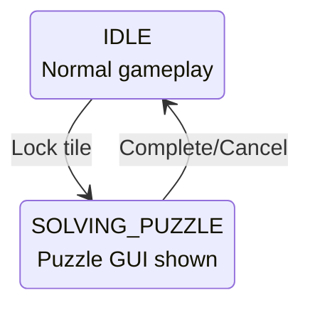
```mermaid
stateDiagram-v2
    IDLE: IDLE<br/>Normal gameplay
    SOLVING_PUZZLE: SOLVING_PUZZLE<br/>Puzzle GUI shown

    IDLE --> SOLVING_PUZZLE: Lock tile
    SOLVING_PUZZLE --> IDLE: Complete/Cancel
```

Players in `SOLVING_PUZZLE` take no damage. Death is tracked separately by the `isDead` flag.

### World Configuration

| Config | Value |
|--------|-------|
| Floor Size | 100 x 200 units |
| Frame Slots | 400 |
| Available Tiles | 800 (2 per slot) |
| Max Active Tiles | 50 on floor |
| Player Max Health | 100 |
| Tile Damage | Up to 20, scaled by impact speed (hits above 20 units/s only) |
| Tile Damage Cooldown | 1s per tile-player pair |
| Fork Damage | 5 per hit |
| Fork Attack Range | 10 units |
| Respawn Delay | 3s |

---

## Puzzles System

### Multiple Choice Flow

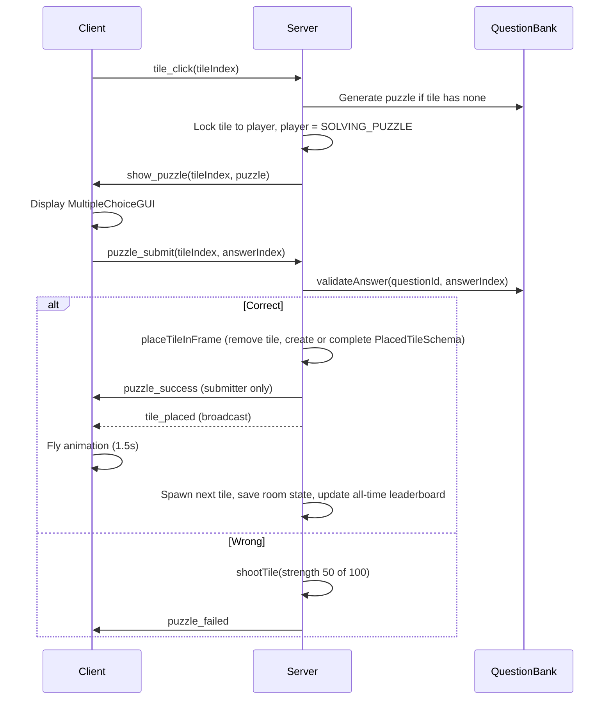
```mermaid
sequenceDiagram
    participant C as Client
    participant S as Server
    participant QB as QuestionBank

    C->>S: tile_click(tileIndex)
    S->>QB: Generate puzzle if tile has none
    S->>S: Lock tile to player, player = SOLVING_PUZZLE
    S->>C: show_puzzle(tileIndex, puzzle)
    C->>C: Display MultipleChoiceGUI

    C->>S: puzzle_submit(tileIndex, answerIndex)
    S->>QB: validateAnswer(questionId, answerIndex)

    alt Correct
        S->>S: placeTileInFrame (remove tile, create or complete PlacedTileSchema)
        S->>C: puzzle_success (submitter only)
        S-->>C: tile_placed (broadcast)
        C->>C: Fly animation (1.5s)
        S->>S: Spawn next tile, save room state, update all-time leaderboard
    else Wrong
        S->>S: shootTile(strength 50 of 100)
        S->>C: puzzle_failed
    end
```

`puzzle_cancel` takes the same path as a wrong answer: the tile is shot away with strength 50 and the player returns to `IDLE`.

---

## GUI Components

| Component | Purpose |
|-----------|---------|
| NameInputGUI | Login screen |
| CompassGUI | Direction display |
| HelpGUI | Controls help |
| EscMenuGUI | Escape menu |
| DisconnectGUI | Disconnect overlay |
| DeathCountdownGUI | Respawn countdown |
| MultipleChoiceGUI | Quiz puzzle |
| LeaderboardWall (3D, `game/`) | All-time leaderboard in the world |
| Scoreboard (3D, `game/`) | Goal scores above each goal |

---

## Data Flow & Communication Patterns

### Player Movement Flow

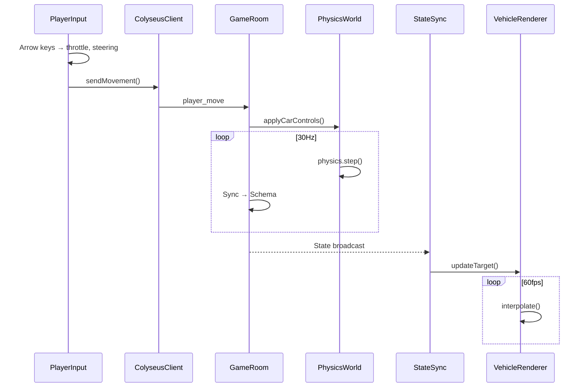
```mermaid
sequenceDiagram
    participant PI as PlayerInput
    participant CC as ColyseusClient
    participant GR as GameRoom
    participant PW as PhysicsWorld
    participant SS as StateSync
    participant VR as VehicleRenderer

    PI->>PI: Arrow keys → throttle, steering
    PI->>CC: sendMovement()
    CC->>GR: player_move
    GR->>PW: applyCarControls()

    loop 30Hz
        PW->>PW: physics.step()
        GR->>GR: Sync → Schema
    end

    GR-->>SS: State broadcast
    SS->>VR: updateTarget()

    loop 60fps
        VR->>VR: interpolate()
    end
```

### Tile Shooting Flow

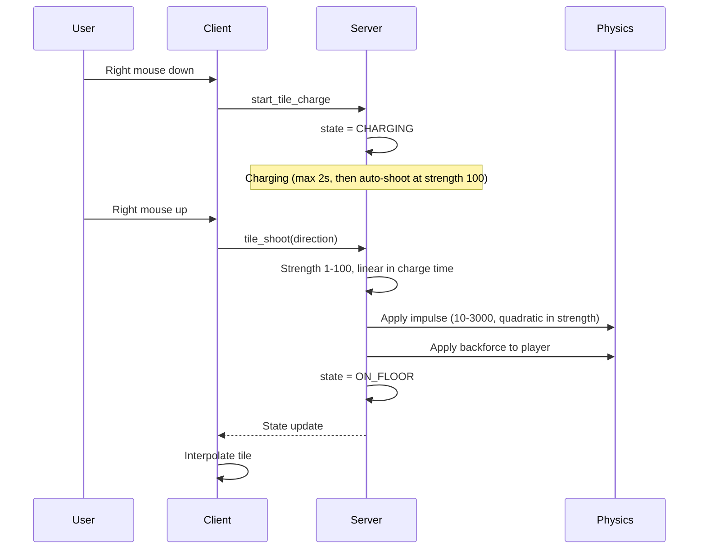
```mermaid
sequenceDiagram
    participant U as User
    participant C as Client
    participant S as Server
    participant P as Physics

    U->>C: Right mouse down
    C->>S: start_tile_charge
    S->>S: state = CHARGING

    Note over S: Charging (max 2s, then auto-shoot at strength 100)

    U->>C: Right mouse up
    C->>S: tile_shoot(direction)
    S->>S: Strength 1-100, linear in charge time
    S->>P: Apply impulse (10-3000, quadratic in strength)
    S->>P: Apply backforce to player
    S->>S: state = ON_FLOOR

    S-->>C: State update
    C->>C: Interpolate tile
```

### Goal Scoring Flow

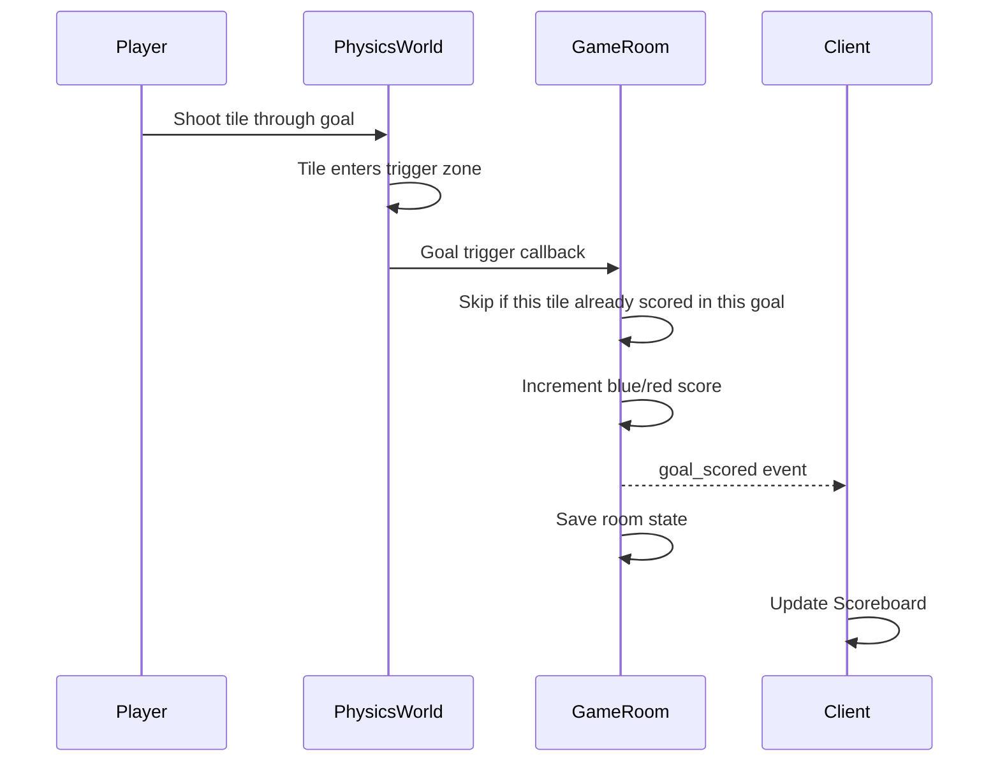
```mermaid
sequenceDiagram
    participant P as Player
    participant PW as PhysicsWorld
    participant GR as GameRoom
    participant C as Client

    P->>PW: Shoot tile through goal
    PW->>PW: Tile enters trigger zone
    PW->>GR: Goal trigger callback
    GR->>GR: Skip if this tile already scored in this goal
    GR->>GR: Increment blue/red score
    GR-->>C: goal_scored event
    GR->>GR: Save room state
    C->>C: Update Scoreboard
```

### Combat Flow

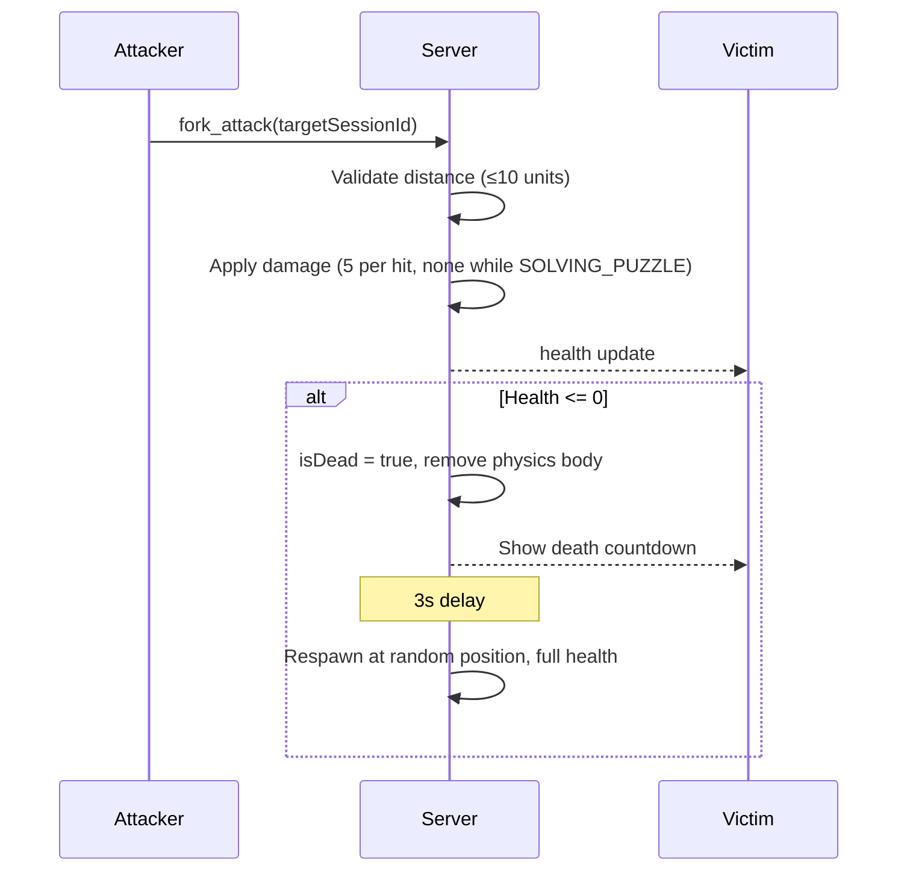
```mermaid
sequenceDiagram
    participant A as Attacker
    participant S as Server
    participant V as Victim

    A->>S: fork_attack(targetSessionId)
    S->>S: Validate distance (≤10 units)
    S->>S: Apply damage (5 per hit, none while SOLVING_PUZZLE)
    S-->>V: health update

    alt Health <= 0
        S->>S: isDead = true, remove physics body
        S-->>V: Show death countdown
        Note over S: 3s delay
        S->>S: Respawn at random position, full health
    end
```

Shot tiles damage players through the same `applyDamage` path. The `respawn` message is a manual respawn from the Esc menu.

---

## Join & Persistence

- A join is rejected if another connected player already uses the same display name (case-insensitive).
- Opening the game in a new tab with the same `playerToken` disconnects the old session (close code 4001).
- On join the server sends `joined` and `slot_states` (half-filled and complete slots).
- A returning player gets their saved tile count back.
- Room state (fill count and completer of each slot, goal scores, player tile counts) is saved after every tile placement and goal, and restored when the room is created. The all-time leaderboard (top 50) is stored in the database.
- On leave, the player is removed immediately and tiles they held return to the floor.

---

## Key File Locations

| Component | Path |
|-----------|------|
| Server GameRoom | `packages/server/src/rooms/GameRoom.ts` |
| Physics World | `packages/server/src/physics/PhysicsWorld.ts` |
| Physics Constants | `packages/server/src/physics/PhysicsConstants.ts` |
| Game Room Schema | `packages/server/src/schema/GameRoomSchema.ts` |
| Tile Schema | `packages/server/src/schema/TileSchema.ts` |
| Placed Tile Schema | `packages/server/src/schema/PlacedTileSchema.ts` |
| Player Schema | `packages/server/src/schema/PlayerSchema.ts` |
| Puzzle Generator | `packages/server/src/utils/PuzzleGenerator.ts` |
| Room State Persistence | `packages/server/src/database/roomState.ts` |
| Question Bank | `packages/shared/src/loaders/QuestionBank.ts` |
| Question Data | `packages/shared/src/data/questions.json` |
| Client Scene | `packages/ui/src/game/Scene.ts` |
| Vehicle Renderer | `packages/ui/src/game/Vehicle.ts` |
| Tile Renderer | `packages/ui/src/game/Tile.ts` |
| Player Input | `packages/ui/src/game/PlayerInput.ts` |
| Raycast | `packages/ui/src/game/Raycast.ts` |
| Colyseus Client | `packages/ui/src/network/ColyseusClient.ts` |
| State Sync | `packages/ui/src/network/StateSync.ts` |
| World Config | `packages/shared/src/config/world.ts` |
| Vehicle / Player Metrics | `packages/shared/src/config/vehicleMetrics.ts`, `playerMetrics.ts` |
